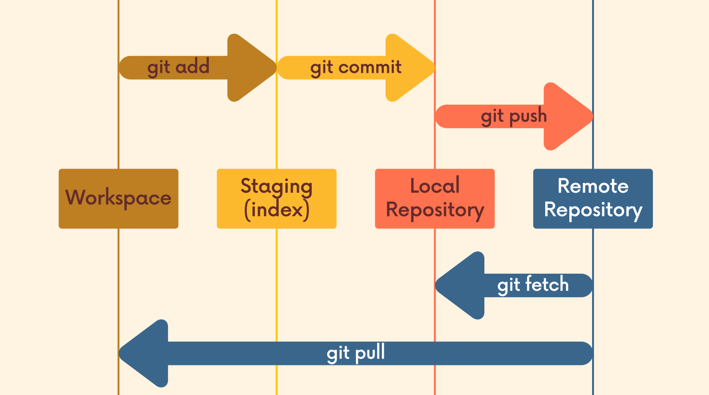
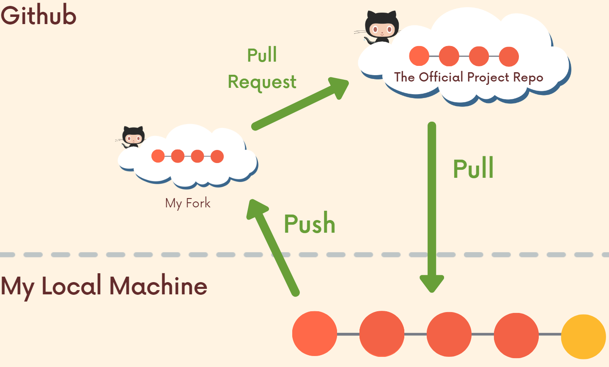
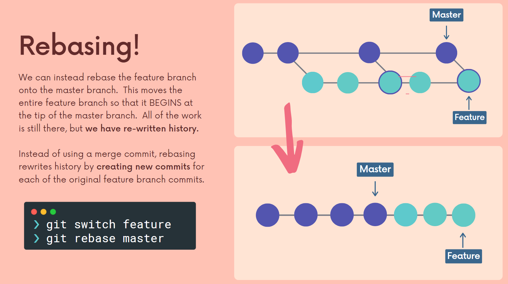
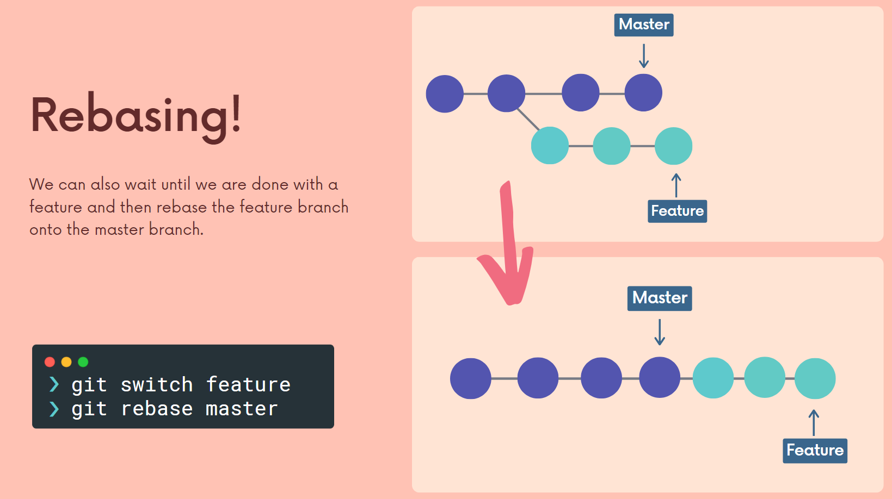
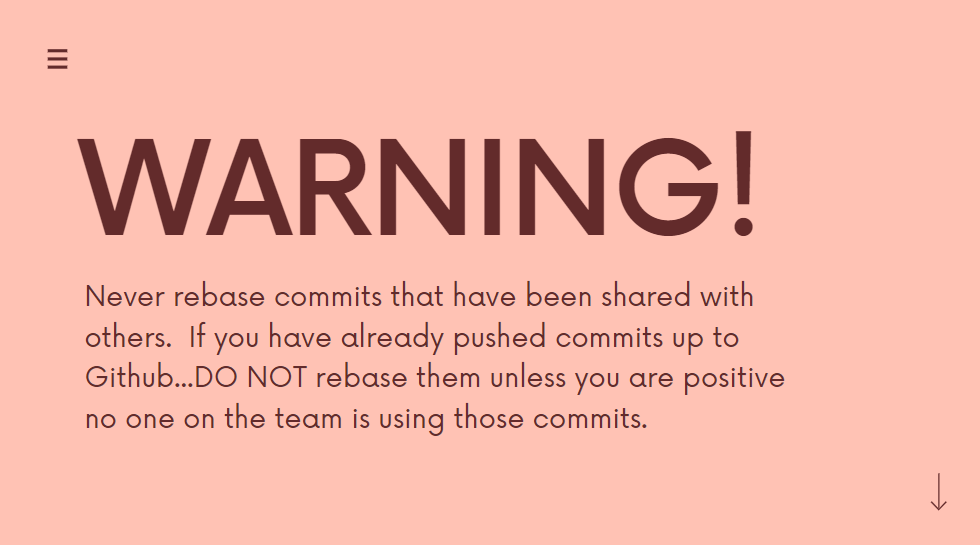
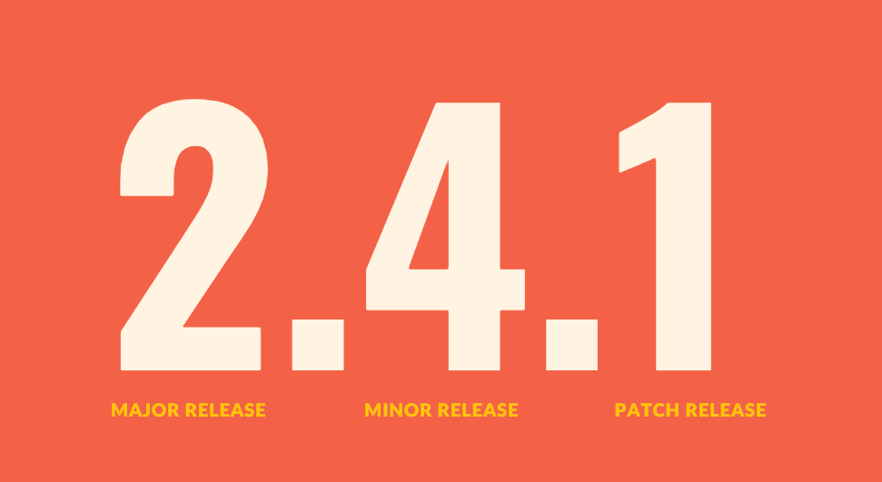

# Git：游戏检查点



## Command

### Basics
```
$ git help <command>: get help for a git command
$ git init: creates a new git repo, with data stored in the .git directory
$ git status: tells you what’s going on
$ git add <filename>: adds files to staging area

$ git commit: creates a new commit
$ git commit --amend
$ git commit -a -m ""
$ git commit -am ""
$ git commit -s
  - try to keep each commit focused on a single thing
  - 使用现在时作为commit message，比如make foo do something
  - 前后用法保持一致就行

$ git log: shows a flattened log of history
$ git log --all --graph --decorate: visualizes history as a DAG
$ git log --oneline
$ git log --pretty

 - .gitignore
  - referemce: https://www.toptal.com/developers/gitignore/

快速启动
init a new one
$ cd ~/.ssh
$ ssh-keygen -o -t rsa -C "email@example.com"
$ cat id_rsa.pub
$ git config --global user.email "you@example.com"
$ git config --global user.name "Your Name"

first time local initialization 
$ git clone git@github.com:cameronmcnz/rock-paper-scissors.git

first time local initialization 
$ echo "# cs143-compilers" >> README.md
$ git init
$ git add README.md
$ git commit -m "first commit"
$ git branch -M main
$ git remote add origin git@github.com:jssonx/cs143-compilers.git
$ git push -u origin main

daily updates
$ git status
$ git add .
$ git add filea fileb ...
$ git commit -m "abc"
$ git push -u origin main
```

### 创建项目
```
$ git init
$ git clone [url]
```

### Branches: 书的书签

#### Branching
```
$ git branch: shows branches
$ git branch <name>: creates a branch
# git branch -c <name>: creates a branch

# git branch -d <name>
# git branch -D <name>: force deletes the branch

# git branch -m <name>: change name of the branch

$ git switch <name>
 - switch之前要commit当前信息

$ git checkout <name>
$ git checkout -b <name>: creates a branch and switches to it
same as git branch <name>; git checkout <name>
```

#### Merging
```
$ git merge <revision>: merges into current branch

don't do anything experiments on main
please on feature/debug branch
 - we merge branches
 - we always merge to the current HEAD branch

类型一：Fast-forward merge：只要是直系关系就会是Fast-forward
 - main上没有修改，只是在branch上修改了一部分之后，
 - 回到main然后将新的branch上的修改merge回来
 - 所有新的branch上的commit都会merge到main
 - 总结：只在branch上commit，不在main上commit => fast forward

类型二：没有冲突，type2merge从main分支，然后main和type2merge都commit过，就可能会有conflict
 - new branch上有更新，同时main上也有更新
 - 两者不存在冲突
 - 回到main，使用git merge type2merge
 - git会在main上创建一个新的commit来merge分支上的信息
 - 没有冲突的原因是两个分支没有修改相同的文件
 - Optional: git branch -d type2merge
 - 只有commit才是存档点，save文件不是
 - 总结：既在branch上commit，也在main上commit，但没conflict => merge without conflict

类型三：有冲突
 - 修改了同一份文件
 - 在main上 git merge type3merge
 - 报conflict错误
 - 打开conflict的文件，删除三个区域界，然后保留需要的代码
 - 保存并关闭文件
 - git add 这份文件
 - git commit -m "resolve conflicts"
 - 总结：既在branch上commit，也在main上commit，有conflict => merge with conflict

$ git mergetool: use a fancy tool to help resolve merge conflicts
$ git rebase: rebase set of patches onto a new base
```

### Diff
保存文件之后就可以git diff了
```
$ git diff
$ git diff HEAD
$ git diff --cached 或 git diff --staged
```

`git diff` compares working directory and the index.

`git diff HEAD` compares working directory and the last commit.

`git diff --cached` compares the index and the last commit.

`the index` refers to the staging area

```
$ git diff branch1 branch2
 - 比较两个分支下所有文件的区别
```

```
$ git diff commit1 commit2
 - 比较两个commit下所有文件的区别
 - 比较两个文件的hash
 - 文件的hash可以通过git log --oneline获得
```

### Stashing
 - 场景：开发者A有两个分支main和feature1。
 - A目前在frature1上写了一些代码还没commit，但突然他需要switch到main去做一些工作。
 - 如果两个分支没有conflict，那么switch会将新的修改后的信息带到main分支上
 - 但是feature1上这些新文件他不想现在就merge到main上
 - 那么可以使用stashing
 - 或者如果有conflict，那么将无法switch
 - 除非commit或者stash
 - 但是如果不觉得这些修改值得一次commit
 - 那么可以选择stash

```
$ git stash
$ git stash pop

$ git stash apply：和pop的区别是，pop之后stash中保存的文件就删除了，但apply之后stash中保存的文件还会继续在
```

`git stash`命令会将当前工作目录中的未提交的更改和文件存储在一个"贮藏"（stash）中，并将工作目录还原到最后一次提交(commit)的状态。这样可以在不丢失更改的情况下切换到另一个分支或者恢复到清理的状态。

有多个stash的情况（少见）
```
$ git stash list
$ git stash apply stash@{2} # 根据id可以调出指定的stash
```

```
$ git stash drop
$ git stash drop stash@{2}
```

### Github: the basics
#### SSH
```
1. cd ~/.ssh
2. ssh-keygen -o -t rsa -C "email@example.com"
3. cat id_rsa.pub
4. git config --global user.email "you@example.com"
5. git config --global user.name "Your Name"
```

### Repo
 - Github上repo的名字不一定和本地一样
 - 最好一样

### Remote
```
$ git remote: list remotes
$ git remote -v
```

Add a new remote
```
$ git remote add <name> <url>
 - 如：git remote add origin http://xxx.git
 - origin is just a name for the url, just like main is the default name for the branch

重命名
$ git remote rename <old> <new>

删除
$ git remote remove <name>
```

### Push
```
$ git push <remote> <branch>
 - <remote>指的是url name，比如origin

$ git push -u <remote> <branch>
 - The -u flag is used to set the upstream repository, which allows you to use the shorthand git push command in the future to push changes to the same remote repository.

$ git push origin <local>:<remote>
 - <local>表示local的分支名称
 - <remote>表示remote的分支名称
 - 该语句表示local和remote的分支名称也可以不同

如果只想push一个文件或文件夹到github的远程仓库，
在add的时候只添加相应的文件或文件夹即可
$ git add <文件名或文件夹名>
$ git add file1.txt file2.txt folder1/ folder2/
$ git add *.txt
$ git add . # 这将会添加当前文件夹下的所有文件

$ git push -u origin main
 - configure the upstream
 - 后面直接用git push
```

### Fetching and Pulling
```
$ git branch -r
 - 查看远程分支
```
```
$ git checkout origin/puppies
 - 该checkout只能用于查看
 - 如果想修改的话需要此时创建一个分支 git switch -c abc

$ git switch puppies
 - 如果不想只是查看另一个远程的分支，
 - 可以使用switch语句，这样的话就可以修改和commit相关代码
```

github有更新的commit，我在本地如何获取？
 - fetching
 - pulling


#### Fetching
使用git fetch不会污染当前的workspace，只会更新本地指针“origin/main”指向的内容。如果想查看的话可以fetch后直接git checkout origin/main
```
$ git fetch <remote>
 - <remote>默认是origin
 - 比如：git fetch origin
$ git fetch <remote> <branch>
 - 比如：git fetch origin main
```
#### Pulling
```
git pull = git fetch + git merge
 - git fetch: update the remote tracking branch with he latest changes from the remote repository
 - git merge: update my current branch with whatever changes are on the remote tracking branch
```

```
$ git pull <remote> <branch>
 - 使用这个语句时所在的branch很重要，在哪个branch上就会merge到哪个branch上
```

```
$ git pull
 - 默认<remote>为origin
 - 默认<branch>为当前branch正在track的branch，一般为当前branch
 - 综上，使用git pull一般直接pull当前branch在github的最新commit
```

 - 当要push到远程仓库的时候，首先应该看一下git fetch然后git diff origin/branch看看代码是否有区别，然后使用git merge。举例：
```
$ git fetch origin main
$ git diff origin/main main
$ git merge origin/main

以上三句略等于以下一句：
$ git pull origin main
```

### Undo
```
$ git commit --amend: edit a commit’s contents/message
$ git reset HEAD <file>: unstage a file
$ git checkout -- <file>: discard changes
```

### Advanced Git
```
$ git config: Git is highly customizable
$ git clone --depth=1: shallow clone, without entire version history *
$ git add -p: interactive staging
$ git rebase -i: interactive rebasing
$ git blame: show who last edited which line *
$ git stash: temporarily remove modifications to working directory *
$ git bisect: binary search history (e.g. for regressions)
.gitignore: specify intentionally untracked files to ignore *
```

## Workflow

### Centralized Workflow
每个人都在main上工作（所以自己在不同的机器上其实也应该尽量用不同的branch来工作）

先
```
$ git fetch origin main
$ git diff origin/main main
$ git merge origin/main
```
或者直接
```
$ git pull origin main
 - 但是这样的话一般会报错，远程repo里的内容会覆盖本地内容
 - 需要在pull之前先将本地的工作commit或stash
   - 比如：git stash
   - 然后使用git pull
   - 然后使用git stash out。这时候一般会conflict，git会阻止这次pop
   - 那么需要手动resolve the conflict
     - 使用git status查看有哪些文件有冲突
     - 使用git diff查看哪些地方有冲突
     - 解决冲突
     - 然后使用git add
    - 注：git stash pop可以使用git stash apply代替，apply的好处是这些stash在手动drop前一直存在
```

再
```
$ git push origin main
```

### Feature Branch Workflow
 - branch的起名方法：使用前缀"feature", "bugfix", "hotfix" or "release"。比如：
   - "feature/new-login-system"
   - "bugfix/fix-login-error"

查看远程有哪些branch
```
$ git branch -r
```

只想查看某个分支
```
$ git checkout origin/navbar

然后使用git switch - 就可以回到checkout之前所在的分支
$ git switch -

如果想修改navbar分支上的代码并commit，可以switch过去
$ git switch navbar
```

### Pull Request

**重要**

作为reviewer，看到别人提交的PR有conflict的时候，可以这么做：

Step1
```
$ git pull origin main
 - 这一句是optional的，取决于当前main是否落后于远程的origin/main
$ git fetch origin
 - 此时在本地的main上
$ git switch [branch]
 - [branch]：相应分支的名字
 - 这一句等价于：git checkout -b [branch] origin/[branch]
$ git merge main
 - 执行完这一句之后会报conflict
 - 然后正常到需要resolve的文件改错
 - 完成之后save文件、add、commit
 - 此时到了后续可以顺利将该分支merge到main的状态
```

Step2
```
$ git switch main
 - 这句等价于：git checkout main
$ git merge --no-ff [branch]
 - 会弹出merge时提交的commit的需要填写的comment
$ git push origin main
 - 此时github上显示PR conflict界面会自动refresh并显示成功merge了PR
```

### Fork & Clone



在没有成为official contributor的情况下，任何人都可以不经过许可地为项目commit->提PR

在github界面点击PR button即可

工作流总结
 - Fork the repository
 - Clone the fork
 - Add upstream remote
 - Do some work
 - Push to origin
 - Open pull request

**举例**
 - 对于项目Atest，点击fork
 - 将fork后的项目Atest-forked clone到本地
 - Setting up a second remote
   - 获取原项目Atest的url
   - git remote add upstream [Atest的url]
   - 此时使用git remote -v可以看到两个remote，origin和upstream
 - 此时如果Atest项目有了新的commit，可以这样更新：
   - git pull upstream main
 - git push origin main
 - 在github页面提PR

### Rebase




**重要**

我不想我的feature分支离最新的main分支太远，我可以选择：
 - merge origin/main分支到我的本地分支
   - 问题在于，git log会显示大量的与我的修改无关的、其他人提交的commit
   - 进一步的，如果我将我的分支push和merge到origin main，main中会有大量的merge commits

使用rebase一般有两种目的：
1. 作为merge的替代
2. 作为一个cleanup工具

rebase的话，首先需要将main pull到本地，然后使用
```
$ git rebase main
```

在 feature 分支上执行 git rebase main 并不会对 main 分支上的代码产生任何影响。

git rebase 命令是用来重构历史记录的，它可以将 feature 分支上的提交移动到 main 分支上，使得 feature 分支上的代码更新到最新版本。这样做的好处是，可以减少 merge 冲突和保持历史记录的整洁。

但是，这个过程只会影响 feature 分支上的代码，不会对 main 分支产生影响。这意味着，您可以在 feature 分支上重构提交历史记录，而不会影响 main 分支上的代码。

在进行重构操作时候一定要注意，不能对已经提交到公共仓库的分支进行重构，否则会对其他人的工作造成影响。

**什么时候不要rebase？**



如果rebase遇到conflict了，可以暂停rebase：(也可以解决conflict)
```
$ git rebase --abort
```
也可以解决conflict
```
解决完之后：
$ git add
$ git rebase --continue
```

### Cleaning history with interactive rebase

就像上一节提到的，使用rebase一般有两种目的：
1. 作为merge的替代
2. 作为一个cleanup工具：使用git rebase重写、删除、重命名commits

```
$ git rebase -i HEAD~9
 - 仅需修改数字，若仅需修改最近一次commit则将9改为1
 - 修改过去的commit的commit message：
   - 可以使用git commit --amend
   - 也可以使用git rebase -i HEAD~6，然后reword
   - **reword**：重写commit内容
 - **fixup**：
   - 删除该条commit信息，保留这次commit修改的代码等
   - 被删除的这个commit的修改信息会被添加到更早一次的commit中
   - 一次可以fuxup多个commit
   - all of them will be smushed into the previous commit and those messages will be lost
 - **drop**：既删除commit信息，也删除commit的修改记录
```

### Git tags
Tags一般用来标记重要时刻，比如经常用来标记项目的版本发布，比如v4.1.0, v4.1.1等。

Tags仅仅是commit上的标记而已，不会改变相关信息。

#### Sementic Versioning

 - Major Release 1.0.0：较难向后兼容的更新
 - Minor Release 0.1.0：feature级更新
 - Patch Release 0.0.1：补丁级小更新

#### 查看tags
```
$ git tag
$ git tag -l(是List) "*beta*"
 - 使用regex做filter
```
#### 查看tags指向的内容
```
$ git checkout <tag>
$ git switch -c ABC
 - 用来在这个tag的基础上继续做事
```
#### Tags Diffing
```
$ git diff <older-tag> <newer-tag>
```

#### 创建Lightweight tags
```
$ git tag <tagname>
```

#### 创建Annotated tags
```
$ git tag -a <tagname>
```

#### 展示tag的信息
```
$ git show <tagname>
 - 会展示tag名称、annotated信息、commit名称、commit信息
```

#### Tagging previous commits
```
$ git tag <tagname> <commit hash>
$ git tag -a <tagname> <commit hash>
```

#### 将一个tag移动到另一个commit上
```
$ git tag -f <tagname> <commit hash>
```

#### 删除 
```
$ git tag -d <tagname>
```

#### push tags
```
$ git push --tags
$ git push origin <tagname>
```

## 场景举例

### 如何写标准的commit message
references:
 - 模板与设置模板：https://zj-git-guide.readthedocs.io/zh_CN/latest/message/%5Bgitmessage%5D%E6%8F%90%E4%BA%A4%E6%A8%A1%E6%9D%BF/

模板
```
# head: <type>(<scope>): <subject>
# - type: feat, fix, docs, style, refactor, test, chore
# - scope: can be empty (eg. if the change is a global or difficult to assign to a single component)
# - subject: start with verb (such as 'change'), 50-character line
#
# body: 72-character wrapped. This should answer:
# * Why was this change necessary?
# * How does it address the problem?
# * Are there any side effects?
#
# footer: 
# - Include a link to the ticket, if any.
# - BREAKING CHANGE
#
```

修改全局配置文件~/.gitconfig，添加
```
[commit]
    template = ~/.gitmessage
```

设置默认编辑器
```
$ git config --global core.editor vim
```

### 回滚与版本控制
```shell
$ git init
$ git branch -m main
$ git status
$ ls -alh
$ echo "hello git" >> hello.txt
$ git add hello.txt
$ git commit -m "init commit"
$ git log
$ echo "test2" >> world.txt   
$ git add hello.txt
$ git commit -m "add world.txt"
$ git log
$ git checkout 6064ad7fece0d264897bc5806dc715e0e204dc42 （回滚）
$ echo "one new line" >> hello.txt
$ git diff hello.txt
```

### Debugging
想要加很多log，但是bug改完之后要把这些log删掉。但是又不想污染主分支

```
$ git status
$ git checkout -b debug
$ git checkout main
$ git checkout debug
"add in debug branch"
$ git commit -asm "debug: add info"
$ git commit -as
$ git log
$ git log --oneline
```

## Git的结构介绍
### Snapshots
文件在git中被称为blob
目录在git中被称为tree
```
<root> (tree)
|
+- foo (tree)
|  |
|  + bar.txt (blob, contents = "hello world")
|
+- baz.txt (blob, contents = "git is wonderful")
```

### Data model as Code
```
// a file is a bunch of bytes
type blob = array<byte>

// a directory contains named files and directories
type tree = map<string, tree | blob>

// a commit has parents, metadata, and the top-level tree
type commit = struct {
    parents: array<commit>
    author: string
    message: string
    snapshot: tree
}
```
### Objects and content-addressing

In Git data store, all objects are content-addressed by their SHA-1 hash.

```
type object = blob | tree | commit

objects = map<string, object>

def store(object):
    id = sha1(object)
    objects[id] = object

def load(id):
    return objects[id]
```

### References as Code
```
references = map<string, string>

def update_reference(name, id):
    references[name] = id

def read_reference(name):
    return references[name]

def load_reference(name_or_id):
    if name_or_id in references:
        return load(references[name_or_id])
    else:
        return load(name_or_id)
```

### Repositories & Staging Area

A Git repository: objects and references

## Q&A
1. Git中，detached HEAD是什么意思？

在 Git 中，"detached HEAD" 状态指的是你不再在某个分支上。
这意味着你目前不在特定的分支上工作，任何更改都不会被添加到分支中，直到你创建新的分支或切换回现有的分支。
这种状态可能由多种原因引起，例如checkout到特定的提交、已删除的分支或已重置的分支。
重要的是要注意，在分离的HEAD状态下，提交不会被添加到分支中，并且在切换到其他分支或创建新分支时会丢失所做的所有提交。

2. Your branch is up to date with 'origin/main'.这句话是什么意思？

在本地，main和origin/main是两个独立的指针，如果main和origin/main的内容相同，则提示这句话。但是如果github远程仓库中的main有来自其他合作者的更新，且更新之后的内容没有fetch到本地，那么即使本地的main实际上与远程的main已经不同了，但仍然会显示Your branch is up to date with 'origin/main'

同步的方法是git fetch origin或git fetch origin main

fetch之后git status会提示Your branch is behind 'origin/main' by 1(or x) commit

3. 如果在github上我fork了一个项目，但是这个项目本身又有了很多新的commit。我怎么保持我的fork版本的代码和这个项目的代码保持一致呢

你可以在你的 fork 上设置一个 "upstream" 分支，这样你就可以在你的 fork 上同步原项目的最新更新了。你可以使用以下命令来设置 upstream 分支：

```
$ git remote add upstream https://github.com/ORIGINAL_OWNER/ORIGINAL_REPOSITORY.git
```
然后你可以使用以下命令来同步你的 fork 上的代码：

```
$ git fetch upstream
$ git merge upstream/master
```
这个命令会获取 upstream 的最新提交并将它们合并到你的 fork 上。

注意如果在你的本地仓库和upstream仓库有冲突的话，需要自行解决冲突。

4. 如果我想回到过去的某个commit然后在这个commit的基础上继续写代码和commit，不要这个commit之后的代码了。这应该怎么做

如果您想回到过去的某个commit并在此基础上继续写代码和提交，而不保留该commit之后的代码，您可以使用git branch命令在该commit上创建一个新分支。例如：
```
$ git branch new_branch abc123
```
其中abc123是您想要回到的commit的哈希值，new_branch是新分支的名称。

这会在abc123 commit处创建一个新分支，并将HEAD指向该分支。您现在可以在新分支上继续工作并提交更改，而不会影响主分支的代码。

如果您确定新分支是您想要的，可以使用 git branch -D 主分支名称来删除主分支。

最后，您可以使用git merge命令将新分支的更改合并到主分支中。
```
git merge new_branch
```
这样就完成了在过去的commit上继续工作并删除之后的commit的操作。

5. 我刚rebase了，但是我想撤销这次rebase，我应该怎么做

您可以使用git reflog命令找到rebase操作之前的commit hash。然后使用git reset命令将HEAD和指定的commit hash重置回去即可。例如：

```
$ git reflog
 - 查找rebase操作之前的commit hash
$ git reset <commit hash>
```

请确保在运行这些命令之前，您已经将您的工作区清理干净，因为重置会丢失任何未提交的更改。

6. 在git上，我刚merge了，但是我想撤销这次merge，我应该怎么做

```
$ git revert -m 1 <merge commit hash>
 - git revert用于撤销之前的提交
 - -m 1：这个参数是 revert 的选项，它指定了 revert 的模式。在这里，-m 1指的是 revert 在合并模式下运行。这意味着，它会在当前分支上创建一个新的提交，将撤销的更改应用于当前分支。
 - <merge commit hash>: 这是您要撤销的合并提交的哈希值。您可以使用 git log 命令查看提交历史记录并找到该哈希值。
 - 总之这个命令就是在当前分支上创建一个新的提交，将对应的合并提交的更改撤销掉。
 - 请注意，这将创建一个新的提交，将您的代码回滚到合并之前的状态。如果您不想保留这些更改，请在本地执行git reset或git clean命令删除这些文件。
 - 如果你想重置到先前的版本，可以使用git reset命令：git reset --hard <commit hash>，这样就可以完全撤销本次merge了。
```

## Reference
 - https://www.bilibili.com/video/BV1YR4y1E7LX
 - https://www.udemy.com/course/git-and-github-bootcamp